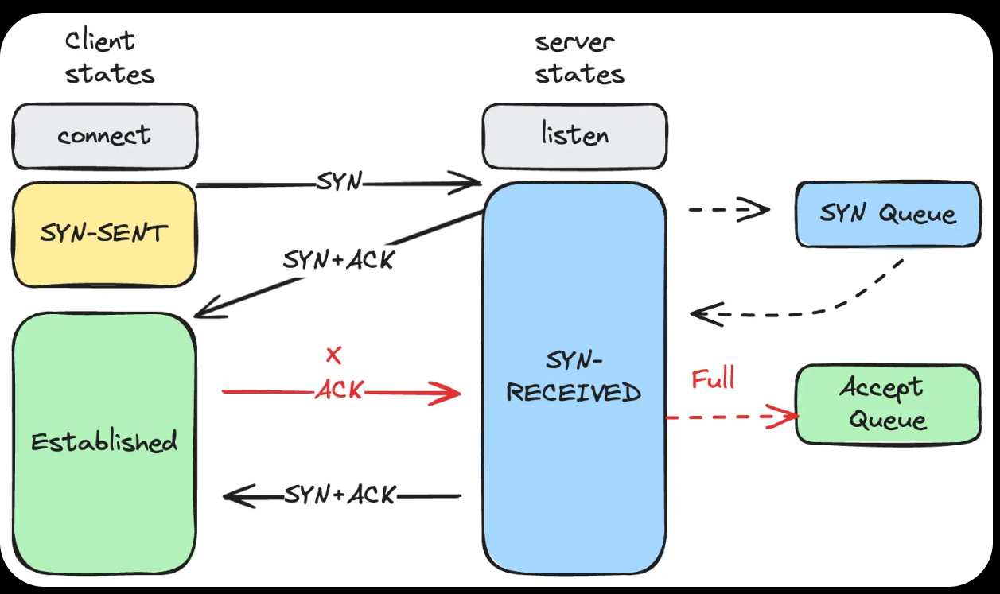

# CS144: Computer Network

This repository contains my implementation of the labs for Stanford CS144: Computer Networks Spring 2023. For learning reference only, please do not plagiarize.

For writeups about this project, please refer to [writeups](writeups/) directory.

## Layered Network Model

Through this project, I gained a deep understanding of the layered architecture of computer networks and the responsibilities of each layer.

### Physical Layer

In this project's Lab 0: Byte Stream, we essentially implemented a simplified version of the physical layer, which provides a means to send and receive raw bytes.

### Data Link Layer

Lab 4 of this project focuses on communication between network interfaces. Previously, I didn't fully grasp the data link layer, but now my understanding is:

   + The data link layer is responsible for communication between directly connected or switch-connected devices within the same subnet.

   + The network layer cannot replace the data link layer! The data link layer also handles collision avoidance and retransmission after collisions.

Our implementation of the network interface uses the ARP protocol, maintaining a local cache of "IP address -> MAC address" mappings. When sending an Ethernet frame, if the MAC address corresponding to the target IP is cached, the packet is sent directly. Otherwise, an ARP request is broadcast to all devices connected directly or via switches to query the MAC address for that IP. (Switches handle packet forwarding, making devices that aren't physically directly connected behave as if they were.)

### Network Layer

Lab 5 of this project implements router logic. My understanding of the network layer is:

   + The network layer enables communication across different subnets.

   + Routers at the network layer use routing algorithms to determine the next-hop network interface.

This lab doesn't involve complex routing algorithms but focuses on implementing the routing table logic. Here, we follow the "longest prefix matching" rule to forward packets to the next-hop network interface (or the destination network interface).

### Transport Layer

Labs 1/2/3 of this project implement the TCP protocol, including sliding windows and timeout retransmission mechanisms. My understanding is that the transport layer provides advanced data transmission features, such as the reliability, flow control, and congestion control offered by TCP.

## The Whole Procedure of Receiving and Transmitting Network Packets

This issue wasn't covered in the current project, but I find it extremely interesting and would like to explore it here:

How exactly do our packets travel from the network card to kernel space and then to user space, or get sent from user space through the kernel to the network card?

Here, we'll discuss the Linux operating system and a relatively common implementation of a network card driver.

The following represents only my personal understanding of the issue. If you find any inaccuracies, I sincerely hope you can notify me via email!

### sock, socket, sk_buff

To gain a deeper understanding of Linux's networking subsystem, let's first examine these three critical data structures in the Linux kernel source code:

+ **struct socket** is an abstraction very close to user space, i.e., BSD sockets used for programming network applications;

+ **struct sock** (or INET socket in Linux terminology) is the network-layer representation of a socket.

+ **struct sk_buff** is the data structure representing a network packet and its state. This structure is created when the kernel processes a packet, whether received from user space or a network interface.

Below, we'll conduct an in-depth analysis through the source code.

#### struct sock

```cpp
/**
  *	struct sock - network layer representation of sockets
  *	@__sk_common: shared layout with inet_timewait_sock
  *	@sk_shutdown: mask of %SEND_SHUTDOWN and/or %RCV_SHUTDOWN
  *	@sk_userlocks: %SO_SNDBUF and %SO_RCVBUF settings
  *	@sk_lock:	synchronizer
  *	@sk_kern_sock: True if sock is using kernel lock classes
  *	@sk_rcvbuf: size of receive buffer in bytes
  *	@sk_wq: sock wait queue and async head
  *	@sk_rx_dst: receive input route used by early demux
  *	@sk_dst_cache: destination cache
  *	@sk_dst_pending_confirm: need to confirm neighbour
  *	@sk_policy: flow policy
  *	@sk_receive_queue: incoming packets
  *	@sk_wmem_alloc: transmit queue bytes committed
  *	@sk_tsq_flags: TCP Small Queues flags
  *	@sk_write_queue: Packet sending queue
  *	@sk_omem_alloc: "o" is "option" or "other"
  *	@sk_wmem_queued: persistent queue size
  *	@sk_forward_alloc: space allocated forward
  *	@sk_napi_id: id of the last napi context to receive data for sk
  *	@sk_ll_usec: usecs to busypoll when there is no data
  *	@sk_allocation: allocation mode
  *	@sk_pacing_rate: Pacing rate (if supported by transport/packet scheduler)
  *	@sk_pacing_status: Pacing status (requested, handled by sch_fq)
  *	@sk_max_pacing_rate: Maximum pacing rate (%SO_MAX_PACING_RATE)
  *	@sk_sndbuf: size of send buffer in bytes
  *	@__sk_flags_offset: empty field used to determine location of bitfield
  *	@sk_padding: unused element for alignment
  *	@sk_no_check_tx: %SO_NO_CHECK setting, set checksum in TX packets
  *	@sk_no_check_rx: allow zero checksum in RX packets
  *	@sk_route_caps: route capabilities (e.g. %NETIF_F_TSO)
  *	@sk_route_nocaps: forbidden route capabilities (e.g NETIF_F_GSO_MASK)
  *	@sk_gso_type: GSO type (e.g. %SKB_GSO_TCPV4)
  *	@sk_gso_max_size: Maximum GSO segment size to build
  *	@sk_gso_max_segs: Maximum number of GSO segments
  *	@sk_lingertime: %SO_LINGER l_linger setting
  *	@sk_backlog: always used with the per-socket spinlock held
  *	@sk_callback_lock: used with the callbacks in the end of this struct
  *	@sk_error_queue: rarely used
  *	@sk_prot_creator: sk_prot of original sock creator (see ipv6_setsockopt,
  *			  IPV6_ADDRFORM for instance)
  *	@sk_err: last error
  *	@sk_err_soft: errors that don't cause failure but are the cause of a
  *		      persistent failure not just 'timed out'
  *	@sk_drops: raw/udp drops counter
  *	@sk_ack_backlog: current listen backlog
  *	@sk_max_ack_backlog: listen backlog set in listen()
  *	@sk_uid: user id of owner
  *	@sk_priority: %SO_PRIORITY setting
  *	@sk_type: socket type (%SOCK_STREAM, etc)
  *	@sk_protocol: which protocol this socket belongs in this network family
  *	@sk_peer_pid: &struct pid for this socket's peer
  *	@sk_peer_cred: %SO_PEERCRED setting
  *	@sk_rcvlowat: %SO_RCVLOWAT setting
  *	@sk_rcvtimeo: %SO_RCVTIMEO setting
  *	@sk_sndtimeo: %SO_SNDTIMEO setting
  *	@sk_txhash: computed flow hash for use on transmit
  *	@sk_filter: socket filtering instructions
  *	@sk_timer: sock cleanup timer
  *	@sk_stamp: time stamp of last packet received
  *	@sk_tsflags: SO_TIMESTAMPING socket options
  *	@sk_tskey: counter to disambiguate concurrent tstamp requests
  *	@sk_socket: Identd and reporting IO signals
  *	@sk_user_data: RPC layer private data
  *	@sk_frag: cached page frag
  *	@sk_peek_off: current peek_offset value
  *	@sk_send_head: front of stuff to transmit
  *	@sk_security: used by security modules
  *	@sk_mark: generic packet mark
  *	@sk_cgrp_data: cgroup data for this cgroup
  *	@sk_memcg: this socket's memory cgroup association
  *	@sk_write_pending: a write to stream socket waits to start
  *	@sk_state_change: callback to indicate change in the state of the sock
  *	@sk_data_ready: callback to indicate there is data to be processed
  *	@sk_write_space: callback to indicate there is bf sending space available
  *	@sk_error_report: callback to indicate errors (e.g. %MSG_ERRQUEUE)
  *	@sk_backlog_rcv: callback to process the backlog
  *	@sk_destruct: called at sock freeing time, i.e. when all refcnt == 0
  *	@sk_reuseport_cb: reuseport group container
  *	@sk_rcu: used during RCU grace period
  */
struct sock {
	/*
	 * Now struct inet_timewait_sock also uses sock_common, so please just
	 * don't add nothing before this first member (__sk_common) --acme
	 */
	struct sock_common	__sk_common;
	socket_lock_t		sk_lock;
	atomic_t		sk_drops;
	int			sk_rcvlowat;
	struct sk_buff_head	sk_error_queue;
	struct sk_buff_head	sk_receive_queue;
	/*
	 * The backlog queue is special, it is always used with
	 * the per-socket spinlock held and requires low latency
	 * access. Therefore we special case it's implementation.
	 * Note : rmem_alloc is in this structure to fill a hole
	 * on 64bit arches, not because its logically part of
	 * backlog.
	 */
	struct {
		atomic_t	rmem_alloc;
		int		len;
		struct sk_buff	*head;
		struct sk_buff	*tail;
	} sk_backlog;
#define sk_rmem_alloc sk_backlog.rmem_alloc

	int			sk_forward_alloc;
#ifdef CONFIG_NET_RX_BUSY_POLL
	unsigned int		sk_ll_usec;
	/* ===== mostly read cache line ===== */
	unsigned int		sk_napi_id;
#endif
	int			sk_rcvbuf;

	struct sk_filter __rcu	*sk_filter;
	union {
		struct socket_wq __rcu	*sk_wq;
		struct socket_wq	*sk_wq_raw;
	};
#ifdef CONFIG_XFRM
	struct xfrm_policy __rcu *sk_policy[2];
#endif
	struct dst_entry	*sk_rx_dst;
	struct dst_entry __rcu	*sk_dst_cache;
	atomic_t		sk_omem_alloc;
	int			sk_sndbuf;

	/* ===== cache line for TX ===== */
	int			sk_wmem_queued;
	refcount_t		sk_wmem_alloc;
	unsigned long		sk_tsq_flags;
	struct sk_buff		*sk_send_head;
	struct sk_buff_head	sk_write_queue;
	__s32			sk_peek_off;
	int			sk_write_pending;
	__u32			sk_dst_pending_confirm;
	u32			sk_pacing_status; /* see enum sk_pacing */
	long			sk_sndtimeo;
	struct timer_list	sk_timer;
	__u32			sk_priority;
	__u32			sk_mark;
	u32			sk_pacing_rate; /* bytes per second */
	u32			sk_max_pacing_rate;
	struct page_frag	sk_frag;
	netdev_features_t	sk_route_caps;
	netdev_features_t	sk_route_nocaps;
	int			sk_gso_type;
	unsigned int		sk_gso_max_size;
	gfp_t			sk_allocation;
	__u32			sk_txhash;

	/*
	 * Because of non atomicity rules, all
	 * changes are protected by socket lock.
	 */
	unsigned int		__sk_flags_offset[0];
	kmemcheck_bitfield_begin(flags);
	unsigned int		sk_padding : 1,
				sk_kern_sock : 1,
				sk_no_check_tx : 1,
				sk_no_check_rx : 1,
				sk_userlocks : 4,
				sk_protocol  : 8,
				sk_type      : 16;
#define SK_PROTOCOL_MAX U8_MAX
	kmemcheck_bitfield_end(flags);

	u16			sk_gso_max_segs;
	unsigned long	        sk_lingertime;
	struct proto		*sk_prot_creator;
	rwlock_t		sk_callback_lock;
	int			sk_err,
				sk_err_soft;
	u32			sk_ack_backlog;
	u32			sk_max_ack_backlog;
	kuid_t			sk_uid;
	struct pid		*sk_peer_pid;
	const struct cred	*sk_peer_cred;
	long			sk_rcvtimeo;
	ktime_t			sk_stamp;
	u16			sk_tsflags;
	u8			sk_shutdown;
	u32			sk_tskey;
	struct socket		*sk_socket;
	void			*sk_user_data;
#ifdef CONFIG_SECURITY
	void			*sk_security;
#endif
	struct sock_cgroup_data	sk_cgrp_data;
	struct mem_cgroup	*sk_memcg;
	void			(*sk_state_change)(struct sock *sk);
	void			(*sk_data_ready)(struct sock *sk);
	void			(*sk_write_space)(struct sock *sk);
	void			(*sk_error_report)(struct sock *sk);
	int			(*sk_backlog_rcv)(struct sock *sk,
						  struct sk_buff *skb);
	void                    (*sk_destruct)(struct sock *sk);
	struct sock_reuseport __rcu	*sk_reuseport_cb;
	struct rcu_head		sk_rcu;
};
```

This struct is Linux's internal implementation of sockets, containing numerous fields - many of which exist to implement advanced features.

For my purposes, I'm particularly focused on the following fields:

```cpp
	struct sk_buff_head	sk_receive_queue;
	/*
	 * The backlog queue is special, it is always used with
	 * the per-socket spinlock held and requires low latency
	 * access. Therefore we special case it's implementation.
	 * Note : rmem_alloc is in this structure to fill a hole
	 * on 64bit arches, not because its logically part of
	 * backlog.
	 */
	struct {
		atomic_t	rmem_alloc;
		int		len;
		struct sk_buff	*head;
		struct sk_buff	*tail;
	} sk_backlog;
	struct sk_buff_head	sk_write_queue;
```

As we can observe, the commonly mentioned socket write queue and receive queue are actually stored within this `struct sock` in the form of `sk_buff_head`, where `sk_buff` elements are linked together via pointer fields to form a linked list. 

The `sk_backlog` serves as another `sk_buff` linked list that functions as a fallback queue. When users fail to promptly retrieve packets from `sock.sk_receive_queue` causing it to reach capacity, this backup queue stores subsequently arriving packets, effectively minimizing packet loss due to queue overflow.

#### struct socket

```cpp
/**
 *  struct socket - general BSD socket
 *  @state: socket state (%SS_CONNECTED, etc)
 *  @type: socket type (%SOCK_STREAM, etc)
 *  @flags: socket flags (%SOCK_NOSPACE, etc)
 *  @ops: protocol specific socket operations
 *  @file: File back pointer for gc
 *  @sk: internal networking protocol agnostic socket representation
 *  @wq: wait queue for several uses
 */
struct socket {
    socket_state        state;

    kmemcheck_bitfield_begin(type);
    short           type;
    kmemcheck_bitfield_end(type);

    unsigned long       flags;

    struct socket_wq __rcu  *wq;

    struct file     *file;
    struct sock     *sk;
    const struct proto_ops  *ops;
};
```

When providing interfaces, we use the `struct socket`, which is a wrapper around the `struct sock` and internally stores a pointer to a `struct sock`. 

#### struct sk_buff

```
                                ---------------
                               | sk_buff       |
                                ---------------
   ,---------------------------  + head
  /          ,-----------------  + data
 /          /      ,-----------  + tail
|          |      |            , + end
|          |      |           |
v          v      v           v
 -----------------------------------------------
| headroom | data |  tailroom | skb_shared_info |
 -----------------------------------------------
                               + [page frag]
                               + [page frag]
                               + [page frag]
                               + [page frag]       ---------
                               + frag_list    --> | sk_buff |
                                                   ---------
```

To simplify and standardize data formats across the network stack, Linux mandates using the `struct sk_buff` to manage packets. For detailed explanations of `sk_buff`, see [struct sk_buff](https://docs.kernel.org/networking/skbuff.html), [Linux sk_buff](https://wiki.linuxfoundation.org/networking/sk_buff), and [How skb works](http://oldvger.kernel.org/~davem/skb.html).

The `struct sk_buff` doesn't store payload copies but maintains pointers (head, data, tail, end) to different parts of the payload (we'll ignore sk_buff's complex linear/page mechanisms for simplicity). The brilliance of sk_buff lies in how protocol headers can be added/removed simply by adjusting these pointers, eliminating the need to copy packet data (including headers) as it moves through protocol layers - only the `struct sk_buff` itself needs copying.

### Receiving Network Packets

When network packets arrive at the NIC (Network Interface Card), modern NIC drivers typically use DMA (Direct Memory Access) technology, allowing dedicated DMA hardware to automatically place packets into pre-allocated memory regions without CPU intervention in this "basic copy process". We can consider this as the first copy of the packet payload, though it occurs without CPU involvement.

Now our packet resides in kernel space. The data structure used to store the packet is determined by the driver. A common approach is to store packet descriptors in a ring buffer, where these descriptors point to the actual packet buffers, facilitating efficient packet retrieval for protocol stack processing. The driver manages DMA markers on these buffers: buffers marked for DMA can interact with DMA hardware, while buffers with DMA markers removed indicate CPU ownership.

Next, the NIC needs to notify the OS kernel that incoming packets require processing. It does this through hardware interrupts. However, during interrupt handling, we must mask other interrupts, so we aim to keep the interrupt handler as brief as possible to minimize missed interrupts. The typical solution is to have the hardware interrupt handler simply schedule a soft interrupt, allowing the actual packet processing to occur in the soft interrupt context on the same CPU.

However, this interrupt-based approach still has performance issues: if every packet triggers an interrupt, wouldn't that create excessive interrupts, wasting CPU resources and decreasing throughput? Beyond interrupts, we can also use polling to notify the kernel of incoming packets. Some modern frameworks like DPDK exclusively use polling to achieve ultra-low latency. For traditional Linux networking, we employ an optimization called NAPI (New API). Its core idea is: when multiple packets arrive, the first packet triggers an interrupt, then the NAPI processing is launched. the kernel thread processes packets in polling mode for a period, enabling batch processing.

(The OS has already created ksoftirqd kernel thread(1 per CPU) at boot time. And the NAPI poller has been added to the CPU polling lits. And for the NAPI polling, there are complicated mechanism to decide the polling window, maybe depending on budget variable or elapsed time.)

After the soft interrupt handler retrieves the packets, if GRO(Generic Receive Offload) is enabled, the packets are handled to the GRO module for packet coalescing. And if RPS(Receive Packets Steering) is enabled here (and it must be multi-queue NIC), there would be some logic about adding the packets to the per-CPU input queue. At in this case, the ksoftirqd thread on the remote CPU will follow the NAPI procedure and finally harvest the packets. No matter how, the packets are passed to the protocol stack. We sequentially deliver them to protocol handlers at the data link layer, network layer, and transport layer - which is exactly what our project implements. BTW, netfilter and a routing optimization are performed inside the network layer protocol stack. A critical consideration here is whether payload copying occurs during protocol stack processing. 

By looking at the implementation of `struct sk_buff`, we can conclude that the protocol stack processing involves zero payload copying! Even TCP sliding window implementation avoids payload copying. Processed data pointers are eventually stored in the socket's receive buffer.(The `sk_buff` is copied into the Rx queue of the corresponding `struct sock`.) After this step, the kernel wakes all blocking read/recv system calls and IO multiplexing calls.

The next copy occurs when users call socket functions like `recv`, transitioning to kernel mode and copying application data from the socket's receive queue sk_buff to the user-provided buffer.

Therefore, in this receive path, only two payload copies occur:
1. NIC DMAing the packet to kernel-space buffers (no CPU intervention)
2. Kernel-to-user space copy during `recv`.

#### About XDP

XDP (Express Data Path) is a kernel technology that enables packet processing at the earliest possible point in the receive path, before packets enter the kernel network stack.

When XDP is enabled, network packets are represented using `struct xdp_buff` during the XDP processing phase. Similar to the `sk_buff` conversion for traditional networking, the raw packet data can be directly accessed via `xdp_buff` without payload copying. 

However, if XDP determines that a packet should be passed to the protocol stack, the `struct xdp_buff` needs to be converted to `struct sk_buff`. The efficiency of this conversion depends on NIC capabilities:

- With "zero-copy" capable NICs, the conversion can occur without additional data copying
- Without zero-copy support, the conversion requires one additional payload copy operation

### Transmitting Network Packets

When applications invoke write/send system calls, the execution transitions into kernel space, where packet data is copied from user memory to a kernel-allocated `sk_buff` structure. For protocols like TCP that require retransmission and flow control, the `sk_buff` gets enqueued in the `send_queue` of the corresponding `struct sock`.

The `sk_buff` then traverses the protocol stack where various network headers are progressively added. If the destination MAC address isn't cached, the stack initiates an ARP resolution process.

For NICs with multiple transmit queues, the system employs either XPS (Transmit Packet Steering, when enabled) or a standard hashing algorithm to determine the appropriate transmission queue.

The device driver's transmit handler then processes the packet. The data first passes through the queue discipline (qdisc) associated with the network interface:
- The qdisc may transmit immediately if resources are available
- Alternatively, it buffers the packet for later transmission during the NET_TX softirq

The driver subsequently:
1. Establishes DMA mappings for device access
2. Notifies the NIC hardware that transmit data is ready

Upon transmission completion, the hardware generates an interrupt. The driver's transmit completion interrupt handler handles this event, typically:
- Triggering NAPI polling via NET_RX softirq
- Cleaning up DMA mappings
- Freeing packet resources during softIRQ processing

### TCP Connection Setup

As a connection-oriented protocol, TCP requires establishing a connection before data transmission can occur. Having examined the packet handling procedures for established connections, we now turn to the connection establishment process itself - a fundamental aspect of TCP's operation.



For the TCP connection setup, the kernel creates these two queues:

+ SYN Queue

Its size is determined by a system-wide setting. Although referred to as a queue, it is actually a hash table.

+ Accept Queue

Its size is specified by the application. It functions as a FIFO queue for established connections.

#### Socket Programming

##### Server

So the procedure of the server side would be: 

1. Call `socket` to create a`struct socket` for listening.

2. Call `bind` to bind the ip address and port number for listening.

```cpp
int bind(int sockfd, const struct sockaddr *addr, socklen_t addrlen);
```

3. Call `listen` for the listening socket to start working. It will create a accept queue for this listening socket.

When a SYN packet arrives:
   - The kernel creates a copy of the socket for the new connection
   - Places this connection socket in the system-wide SYN queue
   - Responds with a SYN-ACK packet

   Upon receiving the final ACK from the client:
   - The connection socket is moved from the SYN queue and it's added to the  accept queue for this listening socket

The `backlog` parameter for `bind` specifies the maximum number of pending connections the kernel should queue for the socket, i.e. the size of the accept queue.

```cpp
int listen (int sockfd, int backlog);
```

1. Call `accept` to take out the first accepted socket in the accept queue for this listening socket for data transmission / reception.

Notice that the accepted queue is not system-wide. There's no contention.

```cpp
int accept (int sockfd, struct sockaddr *fromaddr, socklen_t *addrlen);
```

##### Client

And for the client, the procedure woule be like:

1. Call `socket` to create a `struct socket`.

2. Call `connect` to send `SYN` to the server and wait until the `ACK + SYN` is received from the server or timeout. It will returns 0 if connection is successful and -1 on error.

```cpp
int connect(int sockfd, const struct sockaddr *addr, socklen_t addrlen);
```

### DPDK

DPDK is 10x~100x faster than traditional linux network stack because

1. It allows DMA from / to user space memory, reducing copying.

2. It bypasses the kernel, avoiding the overhead of context switches.

3. It uses polling instead of interrupt for better latency. 

4. It utilizes batch processing to provide better cache hit rates.

5. Threads are pinned to the cores. There's no scheduler overhead.

6. Using lockfree data structures to avoid locking overhead.

7. NUMA-aware memory allocation.

8. Support huge pages to reduce TLB misses.

9. Other optimizations related to the hardware features.

## Reference

1. [How TCP Sockets Work](https://eklitzke.org/how-tcp-sockets-work)

2. [How do network packets get to the CPU from the NIC?](https://www.reddit.com/r/compsci/comments/aj0jpx/how_do_network_packets_get_to_the_cpu_from_the_nic/?rdt=40119)

3. [How to achieve low latency with 10Gbps Ethernet](https://blog.cloudflare.com/how-to-achieve-low-latency/)

4. [What are the differences between Kernel Buffer, TCP Socket Buffer and Sliding Window](https://stackoverflow.com/questions/53691760/what-are-the-differences-between-kernel-buffer-tcp-socket-buffer-and-sliding-wi)

5. [How does buffering for TCP packets work?](https://unix.stackexchange.com/questions/645074/how-does-buffering-for-tcp-packets-work)

6. [How much operations of copy and of read occur in the processing of data in the stack TCP/IP?](https://stackoverflow.com/questions/28127124/how-much-operations-of-copy-and-of-read-occur-in-the-processing-of-data-in-the-s)

7. [data path (travel) of tcp data from "write" syscall downto I/O registers programming](https://stackoverflow.com/questions/2687772/data-path-travel-of-tcp-data-from-write-syscall-downto-i-o-registers-program?rq=4)

8. [Why no zero-copy networking in linux kernel?](https://stackoverflow.com/questions/22150022/why-no-zero-copy-networking-in-linux-kernel)

9. [Raw socket, Packet socket and Zero copy networking in Linux](https://yusufonlinux.blogspot.com/2010/11/data-link-access-and-zero-copy.html)

10. [Monitoring and Tuning the Linux Networking Stack: Receiving Data](https://blog.packagecloud.io/monitoring-tuning-linux-networking-stack-receiving-data/)

11. [Monitoring and Tuning the Linux Networking Stack: Sending Data](https://blog.packagecloud.io/monitoring-tuning-linux-networking-stack-sending-data/)

12. [Illustrated Guide to Monitoring and Tuning the Linux Networking Stack: Receiving Data](https://blog.packagecloud.io/illustrated-guide-monitoring-tuning-linux-networking-stack-receiving-data/)

13. [Linux Networking And Useful Tips for Real-Time Applications](http://amsekharkernel.blogspot.com/2014/08/what-is-skb-in-linux-kernel-what-are.html)

14. [struct sk_buff](https://docs.kernel.org/networking/skbuff.html)

15. [Linux sk_buff](https://wiki.linuxfoundation.org/networking/sk_buff)

16. [How skb works](http://oldvger.kernel.org/~davem/skb.html)

17. [skb data](http://oldvger.kernel.org/~davem/skb_data.html)

18. [The Path of a Packet Through the Linux Kernel](https://www.net.in.tum.de/fileadmin/TUM/NET/NET-2024-04-1/NET-2024-04-1_16.pdf)

19. [使用 TCP 作为传输层时， Linux 发送和接收网络包需要经过几次数据拷贝？](https://www.zhihu.com/question/1886379656162300109)

20. [linux-kernel-labs: Networking](https://linux-kernel-labs.github.io/refs/pull/189/merge/labs/networking.html)

21. [What advances in hardware allowed DPDK to increase performance on packet processing?](https://networkengineering.stackexchange.com/questions/49381/what-advances-in-hardware-allowed-dpdk-to-increase-performance-on-packet-process)

22. [Networking and Sockets: Syn and Accept queue](https://www.kungfudev.com/blog/2024/06/14/network-sockets-syn-and-accept-queue)